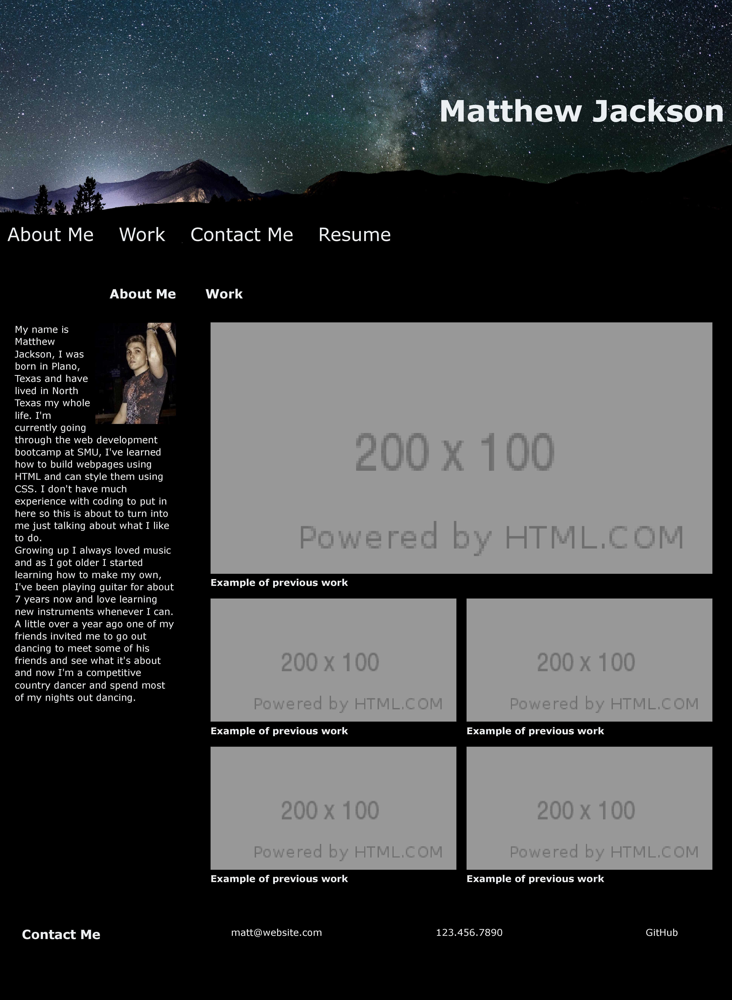

# Portfolio project

## Description
In this project I made a personal portfolio page using HTML and CSS. I used flex box to lay everything out like I wanted, 

## Screenshot

## Link
https://matt4292.github.io/advanced-css-portfolio/